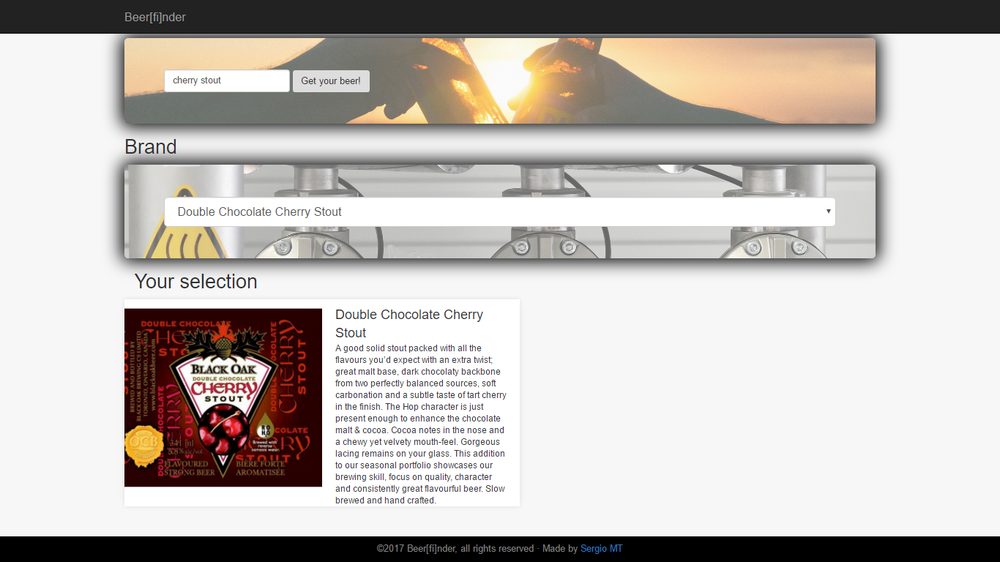

# Beer[fi]nder

This repository is about a beer brand searcher app. I used `HTML`, `CSS` and `jQuery` to write the code.

This app was made at **Skylab Coders Academy** using data from an external `API`

Take a look to **Beer[fi]nder** on this [link](https://misan7.github.io/beerfinder/).

